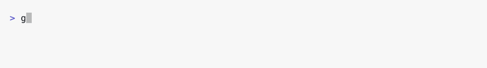
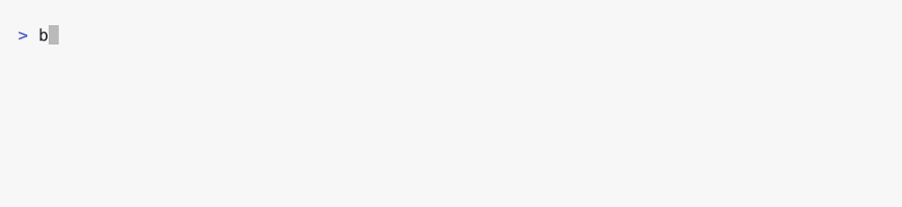

# Project Forge


[Project Forge](https://projectforge.dev) is a long-lived code generator and project manager for Go web apps. It produces a complete Go codebase (with no runtime dependency on Project Forge) and keeps it evolvable: regenerate as your schema, modules, or targets change and keep custom code intact. Project Forge is itself managed by Project Forge; the tooling is continuously exercised in real apps.

Project Forge is a tool for Go-first web apps with predictable latency, minimal JS, and a codebase that can evolve without rewriting foundations. You get a standard Go project that compiles fast, ships everywhere, and stays yours.

## Download

https://projectforge.dev/download


## Source code

https://github.com/kyleu/projectforge


## Installation

### Golang

```sh
go install projectforge.dev/projectforge@latest
```

<picture>
  <source media="(prefers-color-scheme: dark)" srcset="tools/demo/assets/golang-install.gif">
  
</picture>


### Homebrew

```sh
brew install kyleu/kyleu/projectforge
```

<picture>
  <source media="(prefers-color-scheme: dark)" srcset="tools/demo/assets/homebrew-install.gif">
  
</picture>


## 5-minute Quick Start

1. Create a new directory and run the project wizard (accept defaults to start quickly):
    ```sh
    mkdir hello-forge
    cd hello-forge
    projectforge create
    ```

2. Start the dev server:
    ```sh
    ./bin/dev.sh
    # or: make dev
    ```

3. Open http://localhost:20000 (or the port you picked).

4. When you're ready to change features, edit `.projectforge/project.json` and run `projectforge generate`.


## Why it is worth using

- Lifecycle-aware generation, not a one-time scaffold; updates improve your codebase on your schedule
- Performance-first runtime: quicktemplate HTML, zero-JS baseline, small payloads, aggressive caching
- Modular architecture: enable only what you need and ship a minimal or full-stack build


## Core runtime

- Fast HTTP server with MVC helpers and content negotiation (HTML, JSON, CSV, TOML, YAML, XML)
- Quicktemplate rendering for type safety, debugging support, and speed
- Stateless sessions, menu/breadcrumb hierarchy, and consistent request state
- ETag and Cache-Control support with request-aware rendering
- Embedded assets and SVG icon system with symbol reuse


## Web UI/UX

- UI works without JavaScript; progressive enhancement via TypeScript + ESBuild
- Optional JSX engine for lightweight component scripting without heavy frameworks
- Clean, accessible HTML/CSS with light/dark theming based on user preference and an optional theme catalog
- Client bundles and source maps included for fast debugging


## Developer experience

- Sub-second feedback loops and live reload for Go, templates, and client assets
- Debug builds that step through Go, quicktemplate files, and TypeScript
- Template debugging with breakpoints and test workflows
- Rich CLI and a web UI for project health, diagnostics, and admin tooling


## Build, deploy, operate

- Web, [desktop](module/desktop/doc/module/desktop.md), [iOS](module/ios/doc/module/ios.md), [Android](module/android/doc/module/android.md), [WASM](module/wasmserver/doc/module/wasmserver.md), and [notarized](module/notarize/doc/module/notarize.md) macOS targets; ~60 build targets when fully enabled
- Self-contained ~25MB binaries with embedded assets, providing a rich CLI and web API
- CI/CD via GitHub Actions, GoReleaser packaging, optional Docker publishing
- [Auto-upgrade](module/upgrade/doc/module/upgrade.md) via GitHub Releases (optional)
- OpenTelemetry tracing, Prometheus metrics, and structured Zap logging
- Admin UI utilities for profiling, system stats, sitemaps, and debugging


## Feature inventory (all optional via modules)

### Platform targets

- Custom, lightweight [desktop](module/desktop/doc/module/desktop.md) webview apps (Windows/macOS/Linux, ARM64/AMD64)
- [iOS](module/ios/doc/module/ios.md) and [Android](module/android/doc/module/android.md) webview apps
- [WASM client](module/wasmclient/doc/module/wasmclient.md) library and [WASM server](module/wasmserver/doc/module/wasmserver.md) (an offline service-worker running your Go server)
- macOS [notarization](module/notarize/doc/module/notarize.md) support


### Data and schema

- [Database](module/database/doc/module/database.md) abstraction with [PostgreSQL](module/postgres/doc/module/postgres.md), [MySQL](module/mysql/doc/module/mysql.md), [SQL Server](module/sqlserver/doc/module/sqlserver.md), [SQLite](module/sqlite/doc/module/sqlite.md), and [read-only](module/readonlydb/doc/module/readonlydb.md) replicas
- [Migration](module/migration/doc/module/migration.md) engine and [database admin UI](module/databaseui/doc/module/databaseui.md)
- Schema-driven [export](module/export/doc/module/export.md)/codegen (Go + TypeScript)
- [JSON Schema](module/jsonschema/doc/module/jsonschema.md) engine, rich [type hierarchy](module/types/doc/module/types.md) for reflection-free introspection
- High-precision [numeric](module/numeric/doc/module/numeric.md) types for Go and TypeScript


### API and protocol surface

- [OpenAPI](module/openapi/doc/module/openapi.md)/Swagger UI integration
- [WebSocket](module/websocket/doc/module/websocket.md) support with reconnection, queueing, and admin observation
- Secure [HTTP proxying](module/proxy/doc/module/proxy.md)
- [GraphQL](module/graphql/doc/module/graphql.md) APIs with embedded GraphiQL UI
- [HTTP Archive](module/har/doc/module/har.md) (HAR) parsing and tooling


### Auth, users, auditing

- [OAuth](module/oauth/doc/module/oauth.md) 2.0 providers (dozens), permission system, stateless sessions
- [User](module/user/doc/module/user.md) framework (filesystem or database-backed)
- [Audit](module/audit/doc/module/audit.md) trails for changes and actions


### Runtime utilities

- [Filesystem](module/filesystem/doc/module/filesystem.md) abstraction for local, embedded, remote, and browser storage
- [Search](module/search/doc/module/search.md) system with UI and indexers
- [ripgrep](module/grep/doc/module/grep.md) integration
- [Git](module/git/doc/module/git.md) automation and repo workflows
- [Process](module/process/doc/module/process.md) manager with real-time output streaming
- [Task](module/task/doc/module/task.md) engine, queue system, and scheduler
- [Reactive](module/reactive/doc/module/reactive.md) values and observer pattern
- [CEL expression](module/expression/doc/module/expression.md) engine with caching
- Server-side [JavaScript execution](module/scripting/doc/module/scripting.md)
- [Sandbox](module/sandbox/doc/module/sandbox.md) module for experimentation
- [Settings](module/settings/doc/module/settings.md) framework for file-backed config


### UI and content system

- Markdown renderer and [doc browser](module/docbrowse/doc/module/docbrowse.md) with embedded help
- Syntax highlighting via Chroma
- [Rich editor components](module/richedit/doc/module/richedit.md) with progressive enhancement and JSON fallback
- [Icon packs](module/brands/doc/module/brands.md) via simple-icons (brand icons)
- UI components: menus, forms, arguments, tables, tabs, modals, accordions, load screens, flash messages, tag editor, autocomplete, link augments, DOM utilities


### Productivity and QA

- [Playwright](module/playwright/doc/module/playwright.md) E2E testing harness
- [Notebook](module/notebook/doc/module/notebook.md) integration (Observable Framework)
- [Plotting](module/plot/doc/module/plot.md) and data visualization (Observable Plot)
- [Marketing site](module/marketing/doc/module/marketing.md) module with multi-port architecture and download UX


### AI and tooling

- [Model Context Protocol](module/mcp/doc/module/mcp.md) server integration


## Example Applications

- [Rituals.dev](https://rituals.dev) ([GitHub](https://github.com/kyleu/rituals)):
  Work with your team to estimate work, track your progress, and gather feedback.
  - It's a full websocket-driven rich client application, but also works fine without JavaScript

- [TODO Forge](https://todo.kyleu.dev) ([GitHub](https://github.com/kyleu/todoforge)):
  Manages collections of todo items.
  - Almost entirely generated using Project Forge, this is a "stock" application

- [Load Toad](https://loadtoad.kyleu.dev) ([GitHub](https://github.com/kyleu/loadtoad)):
  A tool for uploading HTTP Archives (`.har` files) and running load tests.
  - Also supports client-defined JavaScript, executed in-process on the server

- [Admini](https://admini.dev) ([GitHub](https://github.com/kyleu/admini)):
  A database management application, basically. It does other stuff too.
  - This one is weird, it tried to build a user-defined admin app, but it just ended up looking like a 1990's web portal

- [NPN](https://npn.dev) ([GitHub](https://github.com/kyleu/npn)):
  Basically Postman, it helps you explore and test HTTP services with a focus on speed and correctness.
  - This uses a Vue.js-based rich client application, and a websocket to handle communication

- [Solitaire](https://solitaire.kyleu.dev) ([GitHub](https://github.com/kyleu/solitaire)):
  An example game, not really anything right now.
  - It mainly exists as a testbed for me, and to show the features of Project Forge projects

_More examples coming soon..._

## Documentation

- [Installation](doc/installation.md)
- [Contributing](doc/contributing.md)
- [Customizing](doc/customizing.md)
- [Releasing](doc/releasing.md)
- [Running](doc/running.md)
- [Scripts](doc/scripts.md)
- [Technology](doc/technology.md)

## Licensing

The Project Forge application is released under [MIT](LICENSE.md) license, and all modules and generated code are [CC0](https://creativecommons.org/publicdomain/zero/1.0/). Code used in your project is your own, and should be licensed accordingly.
